# 因子策略市場擇時研究報告

## 1. 隱馬可夫模型市場擇時

本次檢定參考台灣指數公司於2020年發布的隱馬可夫模型因子輪轉策略，利用馬可夫模型將台股市場在時間序列維度下切分為高波動市場與低波動市場，並於低波動市場下使用動能因子（個股過去一個月至一季的累積報酬率），於高波動市場下使用低波動因子（個股過去一年報酬率的標準差）。策略架構圖如下：
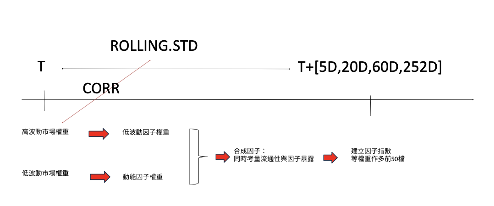

另外於合成因子時，參考原論文定義，為解決流動性問題，我們將合成後及比較標竿之純因子皆於累積常態分配標準化後，與市值因子累積常態分配標準化結果交乘，使模型選股時偏向大市值個股。詳細因子合成定義如下圖：
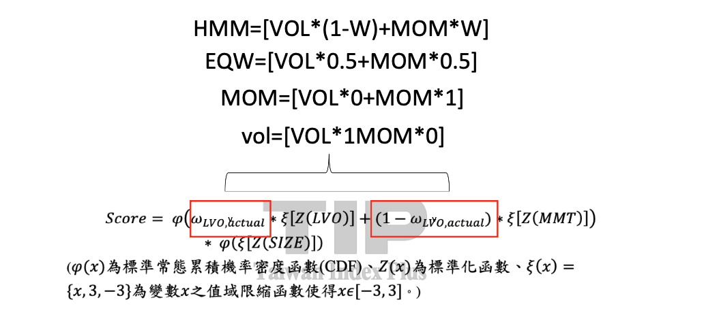

此外，動能因子、低波動因子與市值因子之定義如下：
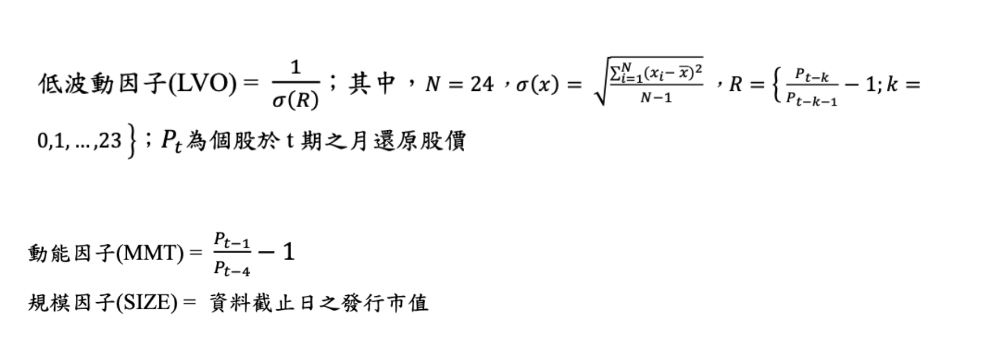

建構隱馬可夫模型之流程圖如下，本研究依照原始論文採滾動500日建構隱馬可夫模型，並且利用滾動120日馬可夫模型所得出之高低波動市場比例作為因子權重。
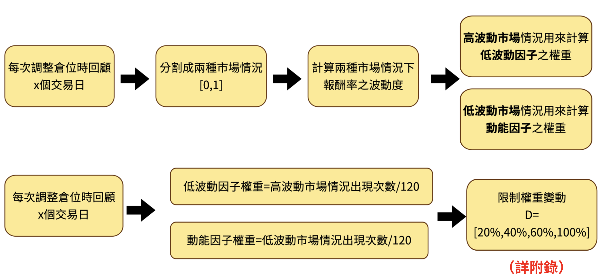

為檢定模型有效性本研究利用因子權重與市場未來n日波動度之相關係數來衡量模型對於未來市場波動度之預測能力、股災時模型成功預測股災(低波動因子權重大於0.5)之交易日平減股災總交易日來預測模型於股災時之保護能力。
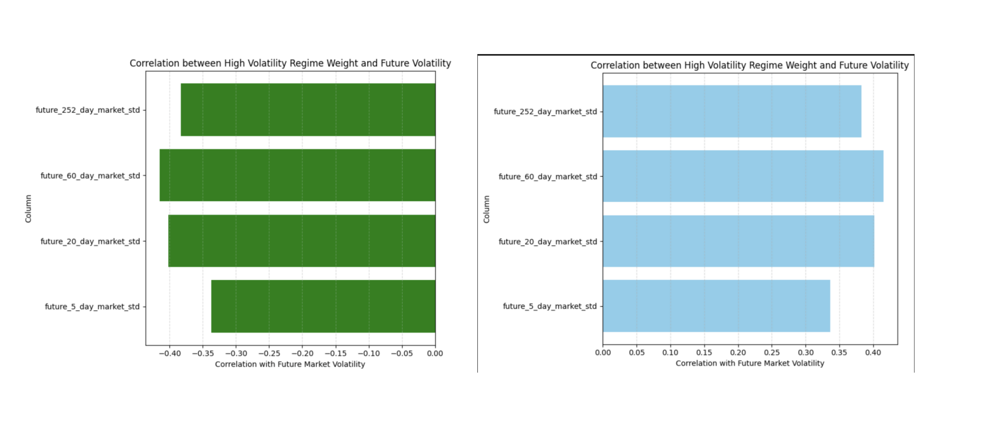
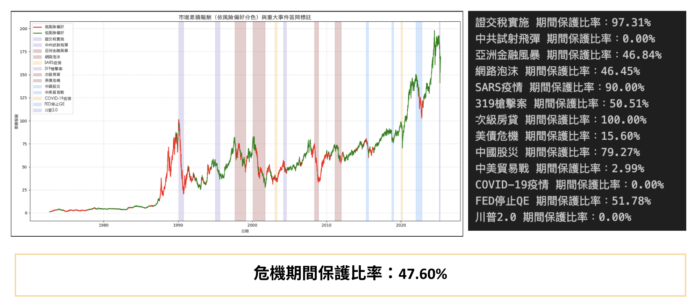

另外由於隱馬可夫模型具有隨機性(本研究隨機種子設定為42)，故對於不同隨機種子進行超參數來檢定模型之魯棒性。
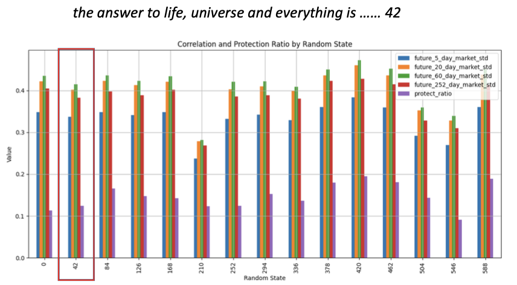

回測交易邏輯採挑選因子值前50大之個股，資金中性下等權重分配投資組合權重，並於每月第一個交易日再平衡投資組合。手續費假設雙邊不打折，滑價衝擊係數設定為0.01，交易限制僅考量漲跌停。策略流程圖如下：
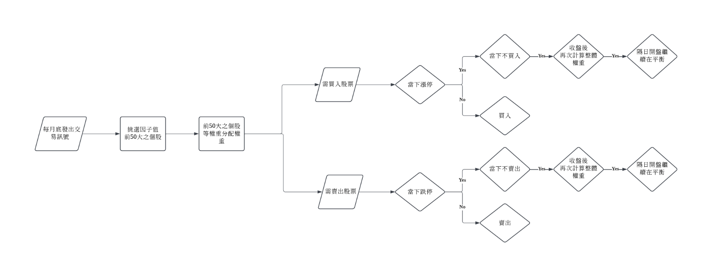

由下回測結果可以得知，在此假設下，利用隱馬可夫模型擇時的輪轉因子策略績效皆優於加權指數、純動能因子、純低波動因子與等權重合成因子。

---

## 2. 雙均線市場擇時

為嘗試較簡單且可避免演算法過度擬合的市場擇時方法，我們使用雙均線策略：當季線大於年線（上升市場）時使用動能因子，當季線小於年線（下降市場）時使用低波動因子。

| 市場狀況     | 說明       | 使用因子   |
|--------------|------------|------------|
| 季線大於年線 | 上升市場   | 動能因子   |
| 季線小於年線 | 下降市場   | 低波動因子 |

對於雙均線策略，本研究一樣從未來市場波動度之預測能力與股災時之保護能力兩個面向來檢定其市場擇時能力，

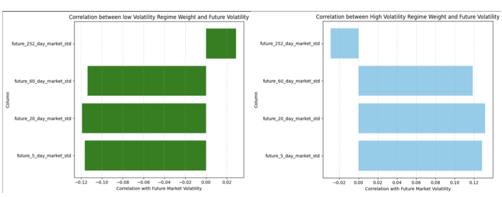
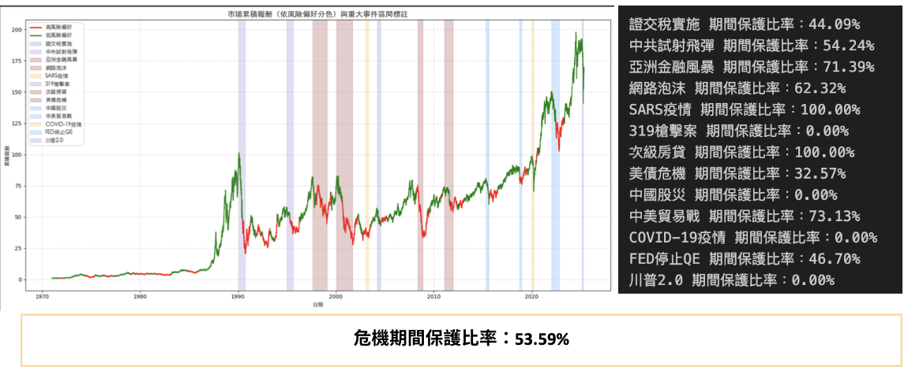

回測交易邏輯同樣挑選因子值前50大個股，資金中性等權重配置，每月首個交易日再平衡，手續費及滑價假設與隱馬可夫模型相同。由下回測結果可以得知，此雙均線擇時輪轉策略績效優於加權指數、純動能因子、純低波動因子與等權重合成因子，但略低於隱馬可夫模型輪轉策略。
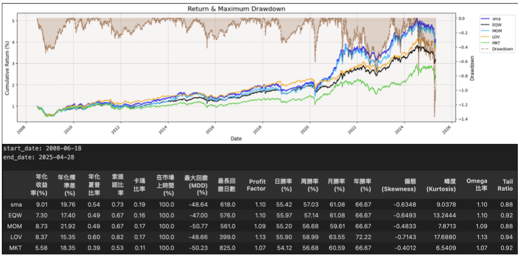

---

## 3. VIX市場擇時

進一步利用VIX指數捕捉市場未來波動性，建構VIX市場因子輪轉策略，邏輯如下：

| VIX區間       | 市場狀況                     | 使用因子   |
|---------------|------------------------------|------------|
| VIX < 10      | 市場過度樂觀可能有下跌風險   | 低波動因子 |
| VIX 介於10~30 | 市場相對穩定                 | 動能因子   |
| VIX > 30      | 市場恐慌                   | 低波動因子 |

對於vix策略，本研究一樣從未來市場波動度之預測能力與股災時之保護能力兩個面向來檢定其市場擇時能力，
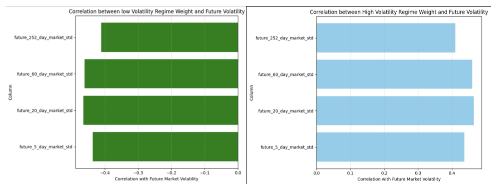
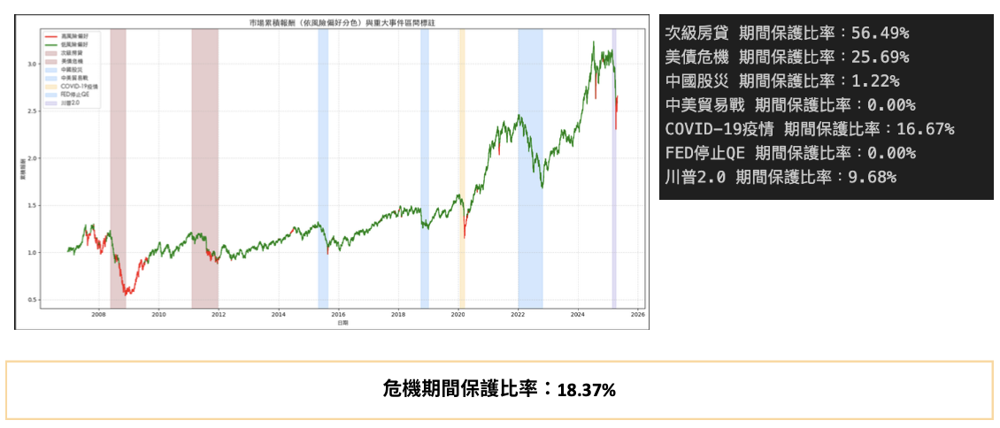

回測交易邏輯與前述相同。由下回測結果可以得知，發現VIX擇時下輪轉策略績效甚至略輸純動能因子策略，顯示VIX擇時具有局限性。
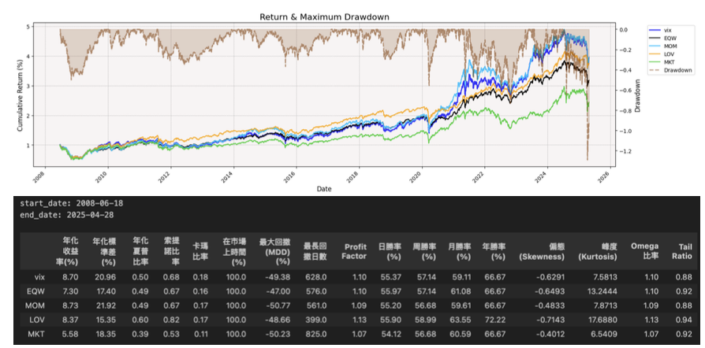

---

## 4. 小結 - 各種模型比較

綜合上述結果，隱馬可夫模型下的因子市場擇時策略，較雙均線及VIX市場擇時策略更具績效優勢。此結果顯示較複雜模型相較傳統技術指標判斷市況仍具有額外價值。

| 模型     | 未來市場波動度之預測能力       | 股災時之保護能力   |
|--------------|------------|------------|
| 隱馬可夫模型 | 佳   | 佳   |
| 雙均線擇時 | 不優   | 佳 |
| VIX擇時 | 佳   | 不優 |

## 5. 附錄 - 隱馬可夫模型之權重限制

