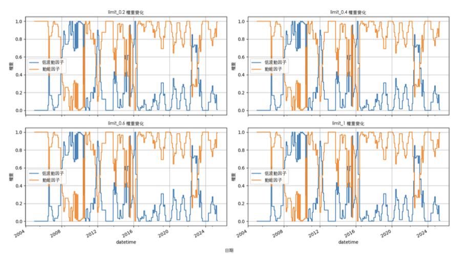
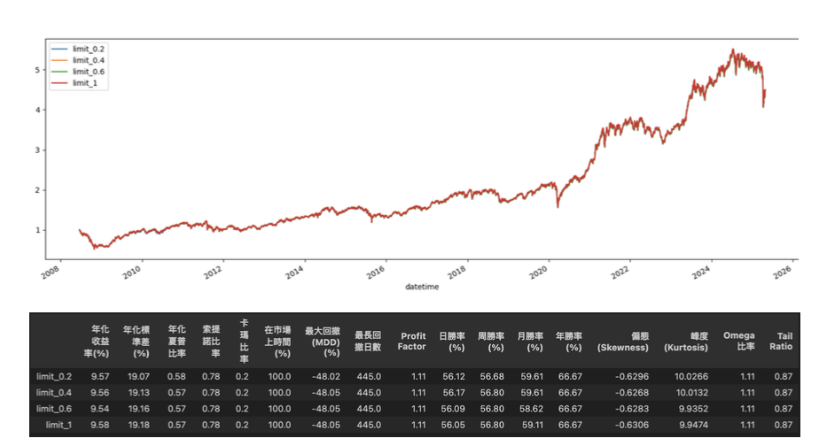

# 因子策略市場擇時研究報告

本研究旨在探討三種市場擇時方法下，動能因子與低波動因子輪動策略的投資績效表現。透過隱馬可夫模型、雙均線指標與VIX波動率指數進行擇時，分析不同市場狀態下使用不同因子能否提高投資組合表現，並從預測能力與股災保護能力兩方面檢驗策略效果。

---

## 1. 隱馬可夫模型市場擇時

參考臺灣指數公司於2020年提出的因子輪轉策略，透過隱馬可夫模型（HMM）將市場日報酬依波動程度分類為高波動與低波動兩種狀態，進行因子策略調整：

- **低波動市場**：採用**動能因子**（近1個月至1季累積報酬）
- **高波動市場**：採用**低波動因子**（近1年報酬標準差）

策略架構圖如下：

為改善流動性問題，研究中將動能與低波動純因子及市值因子經累積常態分配標準化（rank-based normalization）後相乘，使選股偏向大型股：

三因子定義如下：

HMM 模型建構流程如下：

### ✅ 模型檢驗

- **預測能力**：以因子權重與未來 \(n\) 日市場波動度之相關係數衡量
- **股災保護**：以模型於歷次股災期間預測出高風險狀態的成功比例衡量

此外，針對模型之隨機性（本研究設定種子值為42），進行超參數敏感性分析以檢驗其穩健性：

### ✅ 回測設定

- 每月首個交易日進行再平衡
- 選取因子排名前50名個股
- 資金中性、等權重配置
- 交易限制：考慮漲跌停
- 手續費：雙邊不打折
- 滑價衝擊係數：0.01

策略流程圖如下：

### 📈 回測結果

結果顯示 HMM 擇時策略整體優於：
- 台灣加權指數
- 純動能因子
- 純低波動因子
- 等權合成因子策略

---

## 2. 雙均線市場擇時

為比較簡單技術指標是否具有擇時能力，本研究採用**季線與年線雙均線策略**。依移動平均線判斷市場趨勢並選擇因子如下：

| 市場狀況     | 判斷邏輯         | 使用因子   |
|--------------|------------------|------------|
| 上升市場     | 季線 > 年線      | 動能因子   |
| 下降市場     | 季線 < 年線      | 低波動因子 |

### 模型檢驗結果

- 預測未來市場波動能力不佳
- 股災期間保護能力略優於 HMM

### 回測結果

策略績效略低於 HMM 擇時，但仍優於加權指數與單一因子策略。

---

## 3. VIX 指數市場擇時

考量動能與低波動輪動效益是否來自波動預測能力，本研究引入**VIX波動率指數**進行市場分類：

| VIX 區間     | 市場狀況         | 使用因子   |
|--------------|------------------|------------|
| VIX < 10     | 市場過度樂觀     | 低波動因子 |
| 10 ≦ VIX ≦ 30| 市場相對穩定     | 動能因子   |
| VIX > 30     | 市場恐慌         | 低波動因子 |

### 模型檢驗結果

- 預測未來市場波動度能力良好
- 股災保護能力不如 HMM 與雙均線

### 回測結果

VIX 擇時策略績效略低於純動能策略，顯示其輪轉依據具侷限性：

---

## 4. 各模型比較小結

| 模型           | 市場波動預測能力 | 股災保護能力 | 回測績效   |
|----------------|------------------|----------------|------------|
| 隱馬可夫模型   | 優               | 優             | 最佳       |
| 雙均線策略     | 弱               | 優             | 次佳       |
| VIX擇時策略    | 優               | 弱             | 普通       |

結果顯示，**隱馬可夫模型具備較強的市場狀態辨識能力與因子調控優勢**，其擇時策略在市場穩定與劇烈波動期間皆展現良好表現，明顯優於技術指標與單一波動性指標擇時策略。

---

## 5. 附錄：HMM 權重限制參數設定

以下為 HMM 模型於因子輪轉策略中的權重限制圖：

